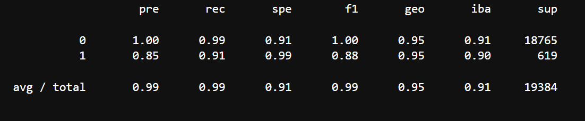
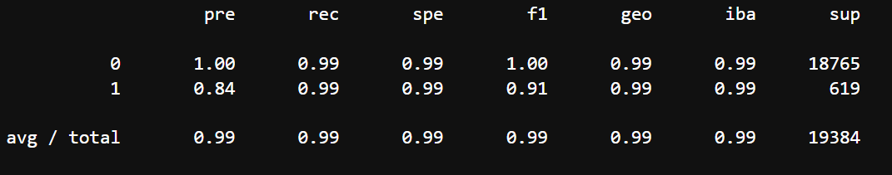

# CFB Module 12 Challenge: Credit Report

## Overview

The goal of the challenge is to build a machine learning model to determine the credit-worthiness of borrowers.  Due to the fact that the credit data is very imbalanced (very few risky loans), a re-sampling of data allows for a more accurate model.  The purpose of the analysis is to compare and evaulate the logistic regression models trained with the original and re-sampled data.

The financial information provided was based on historical loans for borrowers.  The features for each loan included:  loan size, interest rate, borrower income, debt-to-income ratio, number of accounts, deragotary marks, and total_debt.

The variable to predict is whether an inputted loan would remain healthy or be at risk of default; this was a binary output of healthy or risky.  The data set had 75036 healthy loans and 2500 risky loans, so the proportion of risky loans was very low.

The analysis had several steps:
* splitting the data into training and testing sets
* creating a logistic regression model with the original data and generating test statistics
* oversampling to create a balanced data set
* fitting a new logistic regression model with the re-sampled data and generating test statistics
* comparing the test statistics of the two models

The machine learning models were based on logistic regression.

The re-sampling method utilized was random oversampling.

## Results

* Machine Learning Model 1:
    * Accuracy: 0.91 Healthy and 0.90 Risky
    * Precision: 1.00 Healthy and 0.85 Risky
    * Recall: 0.99 Healthy and 0.91 Risky

* Machine Learning Model 2 (Re-Sampled Data):
    * Accuracy: 0.99 Healthy and 0.99 Risky
    * Precision: 1.00 Healthy and 0.84 Risky
    * Recall:  0.99 Healthy and 0.99 Risky

## Summary

 The model fit with re-sampled data (Model 2) had better performance than the model fit with the original data (Model 1).  The data set is imbalanced so the most important metric is not overall accuracy.  In this case, there is an extra importance placed on correctly identifying risky borrowers, the minority class, because that is where large potential losses might occur.  Thus, the relevant metric would be "Recall" for risky borrowers so that loans are not made to potential defaulters.  Model 2 had a much higher Recall for risky borrowers, .99 v. .91.

 While Model 1 had a slightly higher Precision for risky borrowers, the lower Precision for Model 2 would only result in a small amount of missed business.  However, Model 2's much higher Recall of risky borrowers would prevent costly losses from lending to potentially defaulting borrowers.  To top it off, Model 2 also had higher accuracy for both classes of borrowers.  To conclude, I would recommend the Model 2 (based on re-sampled data), mainly because of the significantly higher Recall of risky borrowers.

## Technology

 This application was written in Python 3.7 and requires the use of the following packages:

*[Pandas] (https://github.com/pandas) - Data Analysis

*[Numpy] (https://github.com/numpy) - Array Processing

*[SKLearn] (https://github.com/scikit-learn) - Advanced Data Anaylsis and Machine Learning: Accuracy Score, Confusion Matrix, Imbalanced Classification Report

*[Path] (https://github.com/path) - CSV File Reading

## Contributors
Vishnu Kurella, vishnu.kurella@gmail.com

## License
VK.LQA 2021

